#**Traffic Sign Recognition** 

---

**Build a Traffic Sign Recognition Project**

The goals / steps of this project are the following:
* Load the data set (see below for links to the project data set)
* Explore, summarize and visualize the data set
* Design, train and test a model architecture
* Use the model to make predictions on new images
* Analyze the softmax probabilities of the new images
* Summarize the results with a written report


[//]: # (Image References)


## Rubric Points
###Here I will consider the [rubric points](https://review.udacity.com/#!/rubrics/481/view) individually and describe how I addressed each point in my implementation.  

---
###Writeup / README

####1. Provide a Writeup / README that includes all the rubric points and how you addressed each one. You can submit your writeup as markdown or pdf. You can use this template as a guide for writing the report. The submission includes the project code.

You're reading it! and here is a link to my [project code](https://github.com/stereos/CarND-Traffic-Sign-Classifier-Project/blob/master/Traffic_Sign_Classifier.ipynb)

###Data Set Summary & Exploration

####1. Provide a basic summary of the data set. In the code, the analysis should be done using python, numpy and/or pandas methods rather than hardcoding results manually.

I used the pandas library to calculate summary statistics of the traffic
signs data set:

* The size of training set is 34799
* The size of the validation set is 4410
* The size of test set is 12630
* The shape of a traffic sign image is (32, 32, 3)
* The number of unique classes/labels in the data set is 43

####2. Include an exploratory visualization of the dataset.

Here is an exploratory visualization of the data set. The first 3 is bar charts showing how the data is distributed between the classes in the training, validation and test set, we can see that a few of the classes
has very few items, this is obviously not good because that can lead to poor training and/or overfitting in the other classes. so to solve this we can later create more!


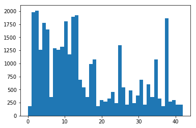
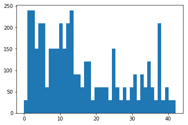
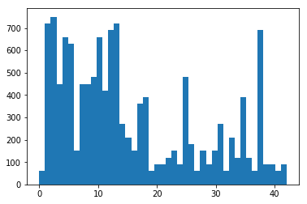


The next image show us one random image from each class, we can see that a few of the pictures is really bad and even hard for humans to identify, and even worse, the one displayed 
below are actually pretty good ones.. But No worries, computers are already smarter than humans and will soon kill us all, so I'm not worried that it wont learn to recognize the images.


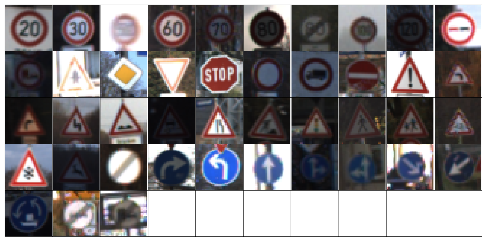

###Design and Test a Model Architecture

####1. Describe how you preprocessed the image data. What techniques were chosen and why did you choose these techniques? Consider including images showing the output of each preprocessing technique. Pre-processing refers to techniques such as converting to grayscale, normalization, etc. (OPTIONAL: As described in the "Stand Out Suggestions" part of the rubric, if you generated additional data for training, describe why you decided to generate additional data, how you generated the data, and provide example images of the additional data. Then describe the characteristics of the augmented training set like number of images in the set, number of images for each class, etc.)

As a first step, I decided to convert the images to grayscale because... at first, mostly because it said so here. But also because the colors shouldn't give that much 
information as trafic sign should be designed to work even for colorblind people. and thus it's the shape etc what's matter. However, we migth loose some information when
converting to grayscale, for example if a pixel is red than yellow beside it, it could be cases where the algorthm to convert it to gray sets both those at the same grade of gray.
There's probably some algorithm to solve this though. I also made it possible to run the deep learning with an color image, but didn't see any improvement.

At the next step I normalized it, I didn't used the (image-128)/128 as sugested, instead i did

```python
def normalize(image):
    minp=np.min(image)
    maxp=np.max(image)
    image=((image-minp)/(maxp-minp))*2-1
    avgp=np.average(image)
    image-=avgp
    return image
```

by using this I ensure the brigthest point becomes 1, and the darkest -1 (as opposed to the other function where 0 becomes -1 and 255 becomes 1).
This makes dark picture get brigther, and over exposed picture gets darker. 
After this I also substract the avrage, so that the avrage of each picture always is 0, the idea of this is that the sign in an dark image with a bright glare 
would still look the same.

Here is an example of a traffic sign image before and after grayscaling and normalizing. At least it's easier for a human to see now, a cnn would probably learn to see it anyway

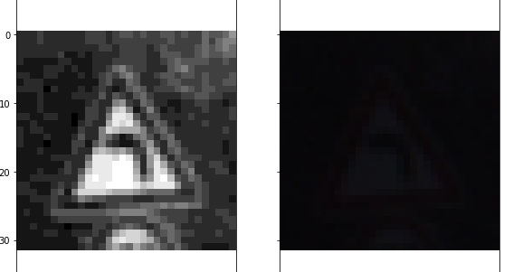


I decided to generate additional data because 1.it wasn't enough before and 2. it's less prone to overfit with more date and 3 more is better, I tried with various number of extra,
but for the model I ran in the end I set the data set to be 5x the orginal, i.e 139196 new images. which made the histogram look much better:
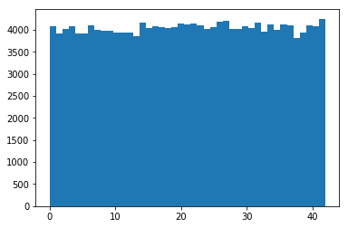

To add more data to the the data set, I used the following techniques:

1. All the classes that is "mirror" of other classes, I flipped  and added to each other. For example all the rigth arrow signs was flipped and added to the left arrow etc etc.

2. Then I randomly draw indexes for all the new images, using a rondom choice with weighted results, where the weights was the inverted amount in each set, In other words I got more from classes with less data, so that in the end I had about the same amount in each set.

For each of those new pictures I then did A few thing, some differed based on the class:
* e.g signs that can be rotated 180 degrees and still be the same I did so with a probability p=0.2,
* Signs that look the same when flipped and still be the same sign, I flipped with a small probability

Then I let signs sligthy rotate with a random degree between -20 and 20( if rotated more some sign migth be another sign, and that's really really bad!)
then I also had a change of movinig a few pixels to the side or up_down..

Here's one example:

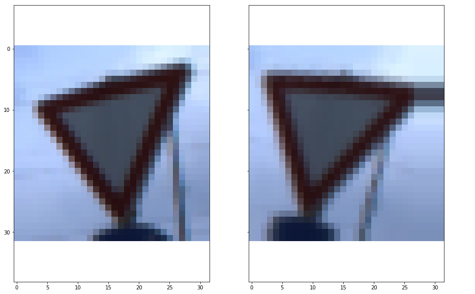

One thing I tried in the end to be able to classify one of the own new pictures(where the sign was a bit away), was to let them also zoom out(or in) pretty much and moved around almost anywhere with a very low probability.
It didn't work better anyway, but it didn't make it worse.. But as can be seen below, my car should be able to drive when drunk! And who wants a boring sober car? (is that legal?)

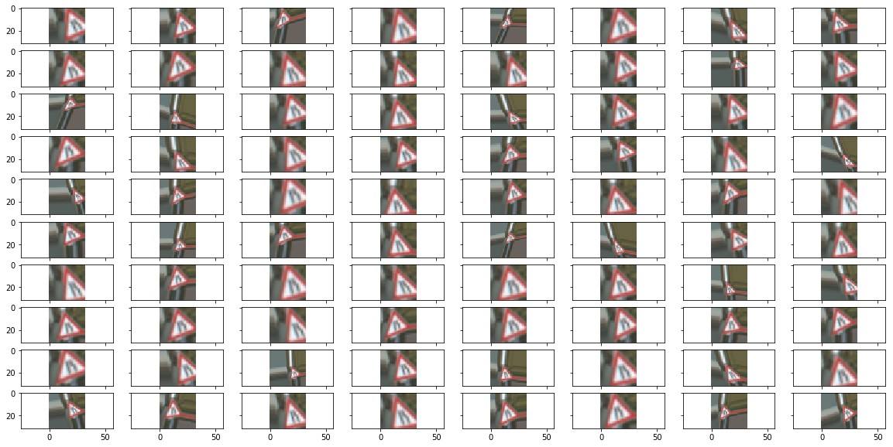


####2. Describe what your final model architecture looks like including model type, layers, layer sizes, connectivity, etc.) Consider including a diagram and/or table describing the final model.

My final model consisted of the following layers:

| Layer         	|     Description	        		| 
|:---------------------:|:---------------------------------------------:| 
| Input         	| 32x32x1 image  				| 
| Convolution 5x5     	| 1x1 stride, same padding, outputs 28x28x20 	|
| RELU			|						|
| Max pooling	      	| 2x2 stride,  outputs 14x14x20			|
| Convolution 3x3	| 1x1 stride, same padding, outputs 12x12x28  	|
| RELU			|						|
| Max pooling	  	| 2x2 Stride, outputs 6x6x28			|
| Convolution  		| 1x1 stride, outputs 4x4x48			|
| RELU			| 						|
| Convolution 1x1	| Outputs 4x4x48				|
| Flatten		| Outputs 768 					|
| Fully connected	| Outputs 320					|
| Dropout 0.5		|						|
| Fully connected	| Outputs 184					|
| Dropout 0.5		|						|
| Fully connected	| Outputs 84 					|
| Dropout 0.5		|						|
| Fully connected	| Outputs n_layer     				|
| Softmax		|      						|


When it comes to optimizer and any hyperparameters such as learning rate. I used the same as in the LeNET tutorial, so AdamOptimizer.
I used differnt batch sizes, but for the run where this data come from I had 1024. And as I had a pretty lot's of training data, the validation_accuracy got very good after only about 20 ephocs. After this the validation goes up and down from about .980 to .987. However, at this point the training accuracy still get's sligtly better.. This migth be because of the training data perhaps has more and harder signs to predict, and thus takes longer time to find its optimal solution. 
But when logging the accuracy and plotting it I noticed that the validation actually got better too! as we can see this in the graph below, and it's clear that even at 500 epochs it's actually getting a bit better.. 
However, I only used 200 when I ran for all the data in this readme, so parhaps I would gotten better result by running even longer.

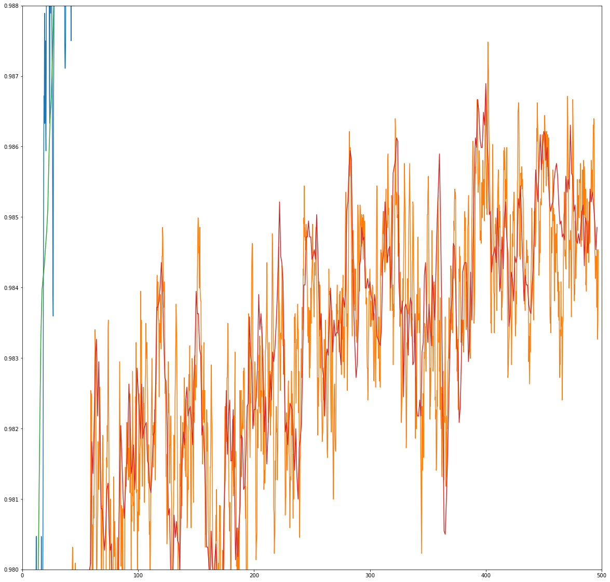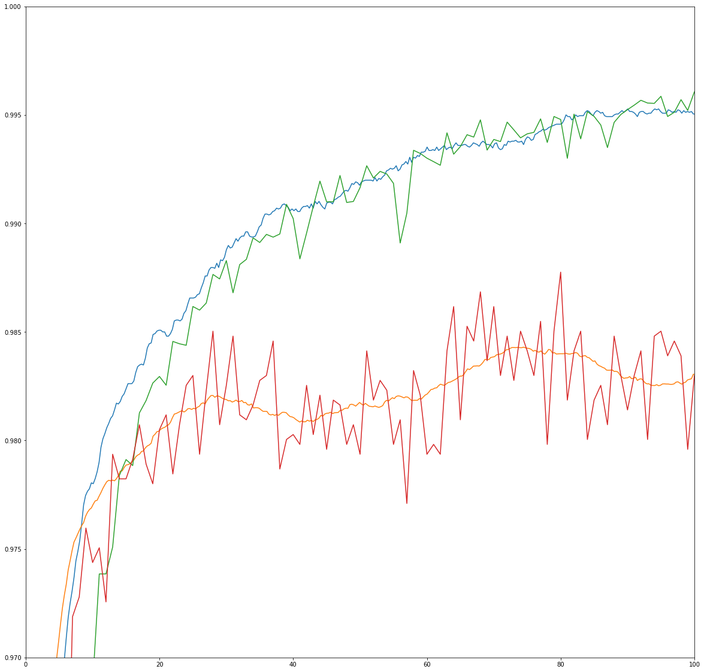

 (I know the axis text is rather small, it's between y=.980 and .988, and x=1 to 500 for the first, and between y=.970 and 1, and x=1 to 100 for second


####4. Describe the approach taken for finding a solution and getting the validation set accuracy to be at least 0.93. Include in the discussion the results on the training, validation and test sets and where in the code these were calculated. Your approach may have been an iterative process, in which case, outline the steps you took to get to the final solution and why you chose those steps. Perhaps your solution involved an already well known implementation or architecture. In this case, discuss why you think the architecture is suitable for the current problem.

My final model results were:

* training set accuracy of 0.986 
(This was checked later on my laptop, so augumented data was different than in the training data used to train. When checking with just the original train data the training set gives 0.999913.(that means that only 3 of the images was classified wrong, These are speed limits for 50,80 and 100.. As can be seen it's a bit tricky but should not be impossible to classify, and if checking the softmax atleast they all predicted speed limits:

| Probability (50)    	|     Prediction (50)	 | Probability (80)    	|     Prediction (80)    | Probability (100)  	|    Prediction (100)	 | 
|:---------------------:|:----------------------:|:--------------------:|:----------------------:| :-------------------:|:----------------------:| 
| 0.5668 		| 80			| 0.8669		| 60 		|0.3586 | 120 |
| 0.4054 		| 50			| 0.1331		| 80 	| 0.1524 | 80|
| 0.0165 		| 100			| 0.0000		| 50 | 0.1088 | 100 |

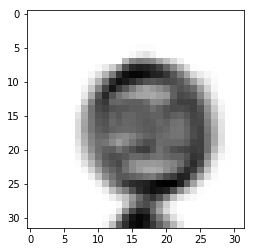
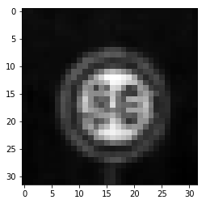
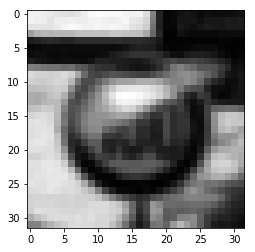

* validation set accuracy of 0.981
* test set accuracy of 0.968
* drunk accuracy of about 0.776 (see above) 

If we split up the test set and try class by class we get


| class         	|     Accuracy	        		| 
|:---------------------:|:---------------------------------------------:| 
|  0.        |    0.98333335
|   1.       |    0.99305556
|   2.       |    0.97466666
|   3.       |    0.94222222
|   4.       |    0.97121212
|   5.       |    0.96031746
|   6.       |    0.97333334
|   7.       |    0.94222222
|   8.       |    0.98000000
|   9.       |    0.96250000
|  10.       |    0.98484848
|  11.       |    0.92619048
|  12.       |    0.98840580
|  13.      |     0.99583333
|  14.      |     0.99629630
|  15.      |     0.99523810
|  16.      |     1.00000000
|  17.      |     0.97777778
|  18.      |     0.94102564
|  19.      |     1.00000000
|  20.      |     1.00000000
|  21.      |     0.94444442
|  22.       |    0.85000002
|  23.        |   1.00000000
|  24.         |  0.94444442
|  25.         |  0.95833333
|  26.         |  0.96111110
|  27.         |  0.85000002
|  28.         |  1.00000000
|  29.         |  1.00000000
|  30.         |  0.72666667
|  31.         |  0.99259259
|  32.         |  1.00000000
|  33.         |  0.98571429
|  34.         |  1.00000000
|  35.         |  0.95641026
|  36.         |  0.97500002
|  37.         |  1.00000000
|  38.         |  0.96086957
|  39.         |  0.98888886
|  40.         |  0.97777778
|  41.         |  1.00000000
|  42.         |  0.92222220

from this list we can see that most classes did pretty good, but 3 classes was really bad 
22. Bumpy road (0.85)
27. Pedestrians (0.85) 
30. Beware of ice/snow (0.72)

When looking closer at what images failed in the "Beware of ice/snow" set many of those is almost impossible, and could have been many different signs. for example

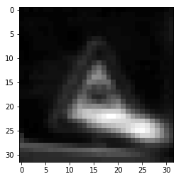

However, 25 of those did look very similar to this:

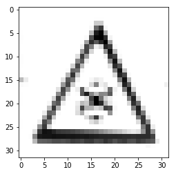
 and these should have been rather easy, but guess it was just no images in the test set that was similar enough .
These 25 images was classified different, but mostly as slippery road. which, maybe it can look like.
Don't want to add all those images, but can be found in the end of the notebook

Among bumpy roads, it mostly got missclassified into road work, and even though it to us migth be clear it's 
bumby sign, I assume that it's because the road work sign has one bump and a person, and somehow the network
think the bump together with the shadow is a person.

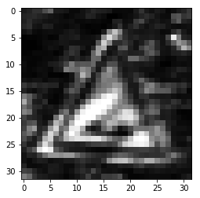

All the failed pedestrian signs looked something like this. I guess the shadow makes it think it's a "Road narrows on the right"

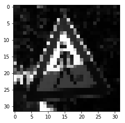

* What was the first architecture that was tried and why was it chosen?

The first was just the LeNet directly from the course,

* What were some problems with the initial architecture?

It wasn't very good, but was already more than 0.93 for validation

* How was the architecture adjusted and why was it adjusted? Typical adjustments could include choosing a different model architecture, adding or taking away layers 
(pooling, dropout, convolution, etc), using an activation function or changing the activation function. One common justification for adjusting an architecture would be 
due to overfitting or underfitting. A high accuracy on the training set but low accuracy on the validation set indicates over fitting; a low accuracy on both sets indicates under fitting.

I added dropout, because it's better againts overfit, added both one more convolution and one fully connected
furthermore I also adde more filters for each convolution.
I also tried adding a 1x1 conv layer as described in the course.

I also made it possible to easier use color images.. but didn't try enough to see if it really changed, as it seems to vary more that what I gained/lost if any.


* Which parameters were tuned? How were they adjusted and why?

Didn't really adjust, tried change the learning rate a bit, but didnt change much so I just keppt the original parameters.

* What are some of the important design choices and why were they chosen? For example, why might a convolution layer work well with this problem? How might a dropout layer
 help with creating a successful model?

Convolution is simply good because it takes in what's around each pixels neigbourhood, so we forexample can learn that a diogonal line is something. Doing the same with only a really huge fully connected would probbably work pretty ok aswell, but I guess it needs to be pretty big, take much longer time and maybe even more data.
The Dropout is there to avoid overfitting by randomly disable nodes.

If a well known architecture was chosen:
* What architecture was chosen?

The LeNet

* Why did you believe it would be relevant to the traffic sign application?

well, I guess my boring answer is because we was told to start from that.

* How does the final model's accuracy on the training, validation and test set provide evidence that the model is working well?

All accuracys was pretty good.that means it's good, if for example just the training set gave good result, it would be an overfit.
 

###Test a Model on New Images

####1. Choose five German traffic signs found on the web and provide them in the report. For each image, discuss what quality or qualities might be difficult to classify.

Here are "five"(seven) German traffic signs that I found on the web:

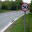
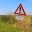
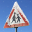
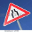


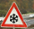

The first image might be difficult to classify because it's far away, this was the reason I added 
the function that added lots of zoomed out images

Second is also a bit away, but should be possible

third is a warning for kids.. it hard because partly covered in snow.. and as I saw after, totaly different..

fourth shows a narrowing road.. Here my network was better than me, because apperently I was wrong, and this is
a narrowing from both sides, not only rigth.. But will it see it as a narrowing from right anyway?

bumpy sign a bit tilted, but very clear.. So should be easy!

Stop sign, Not so hard, so should get this one!

The last one is a snowy warning for snow! This is easy!

####2. Discuss the model's predictions on these new traffic signs and compare the results to predicting on the test set. At a minimum, discuss what the predictions were, the accuracy on these new predictions, and compare the accuracy to the accuracy on the test set (OPTIONAL: Discuss the results in more detail as described in the "Stand Out Suggestions" part of the rubric).

Here are the results of the prediction:


| Image			|      		Prediction	        	| 
|:---------------------:|:---------------------------------------------:| 
| Speed limit (50km/h)  | Yield  					| 
| General caution    	| Speed limit (20km/h) 				|
| Children crossing	| Right-of-way at the next intersection		|
| Road narrows 		| General caution				|
| Bumpy road		| Bumpy road					|
| Stop			| Stop						|
| Beware of ice/snow    | Beware of ice/snow 				|


The model was able to correctly guess 3 of the 7 traffic signs, which gives an accuracy of 0.42.
Which do sound really really bad. But when again looking at what we had, it's really only the General caution which we
can be disapointed about.. and really, a 20km/h sign??? not even close... Atleast the car will slow down which can be good to
do when there's a general caution sign. Especilly because the sign under it says "Stra&szlig;ensch&auml;den!" = "damaged road surface"... So maybe my network is so good it can even read german, and understand that it's good too slow down. So let's say it's 100% match!

For the "Road narrows", one migth think that it should have given us "Road narrows on the right". I don't know if it's good or bad that it does give us "wrong", as the correct answer is not even there.
The Children crossing was infact not the same (I blame google for this), so not really bad that it didn't get the "correct" sign.

Finaly the speed 50km/h.. I think I was hoping too much to get this one. And by looking closer at the image, yield isn't really that bad
choice, like the road part in the image is triangle formed, and when in grayscale, it's a ligth triangle with darker around. This is
one of those cases where color waybe could have made it atleast not think that was a yield.


####3. Describe how certain the model is when predicting on each of the five new images by looking at the softmax probabilities for each prediction. Provide the top 5 softmax probabilities for each image along with the sign type of each probability. (OPTIONAL: as described in the "Stand Out Suggestions" part of the rubric, visualizations can also be provided such as bar charts)

The code for making predictions on my final model is located in the 20th cell of the Ipython notebook.

The top five soft max probabilities for each image was

the sign "Beware of ice/snow" was predicted as:

| Probability         	|     Prediction	        		| 
|:---------------------:|:---------------------------------------------:| 
| 0.9988 		| Beware of ice/snow				|
| 0.0012 		| Right-of-way at the next intersection		|
| 0.0000 		| Double curve					|
| 0.0000 		| Children crossing				|
| 0.0000 		| Road work					|

the sign "Stop" was predicted as:

| Probability         	|     Prediction	        		| 
|:---------------------:|:---------------------------------------------:| 
|1.0000 		| Stop						|
|0.0000 		| Turn right ahead				|
|0.0000 		| Vehicles over 3.5 metric tons prohibited	|
|0.0000 		| Roundabout mandatory				|
|0.0000 		| No entry					|

|the sign "Speed limit (50km/h)" was predicted as:

| Probability         	|     Prediction	        		| 
|:---------------------:|:---------------------------------------------:| 
|1.0000 		| Yield						|	
|0.0000 		| Keep right					|
|0.0000 		| No vehicles					|
|0.0000 		| Priority road					|
|0.0000 		| Beware of ice/snow				|

the sign "General caution" was predicted as:

| Probability         	|     Prediction	       			| 
|:---------------------:|:---------------------------------------------:| 
|0.1629 		| Speed limit (20km/h)				|
|0.1167 		| Traffic signals				|
|0.0865 		| Dangerous curve to the left			|
|0.0682 		| Stop						|
|0.0554 		| Road work					|

the sign "Bumpy road" was predicted as:

| Probability         	|     Prediction	        		| 
|:---------------------:|:---------------------------------------------:| 
|1.0000 		| Bumpy road					|
|0.0000 		| Traffic signals				|
|0.0000 		| Dangerous curve to the right			|
|0.0000 		| Bicycles crossing				|
|0.0000 		| End of all speed and passing limits		|

the sign "Road narrows on the right" was predicted as:

| Probability         	|     Prediction	        		| 
|:---------------------:|:---------------------------------------------:| 
|0.9942 		| General caution				|
|0.0057 		| Traffic signals				|
|0.0000 		| Road narrows on the right			|
|0.0000 		| Pedestrians					|
|0.0000 		| Speed limit (70km/h)				|

the sign "Children crossing" was predicted as:

| Probability         	|     Prediction	        		| 
|:---------------------:|:---------------------------------------------:| 
|1.0000 		| Right-of-way at the next intersection		|
|0.0000 		| Beware of ice/snow				|
|0.0000			| Double curve					|
|0.0000 		| Pedestrians					|	
|0.0000			| Road work					|

we can here see that the signs that we were "supposed" to not fail, was pretty good and the worst had 0.9988.
As said before, the other was just too hard or wrong and obviosly failed. Among those we can see that for "General caution", the network didnt know at all (max probability of 0.16).
However, some that was predicted wrong, like the "children crossing" had a probability of 1.0, this is obviosly not good! 
### (Optional) Visualizing the Neural Network (See Step 4 of the Ipython notebook for more details)
####1. Discuss the visual output of your trained network's feature maps. What characteristics did the neural network use to make classifications?

FeatureMap of the "Beware of snow" sign, first conv layer, but after relu:

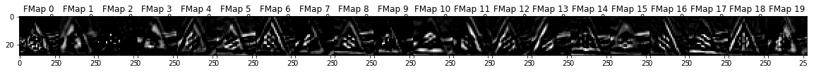

We can see a few interesting thing it picks up, for example in fmap6, where we
can see something snowflaky. We can also see that it sees some triangle part

What hapens if we rotate the image before the network?

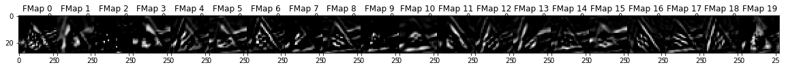

it looks pretty much the same!

And we rotate more?

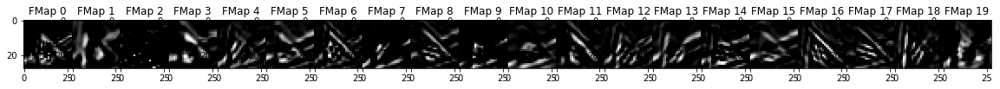

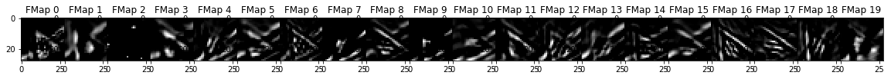

Still looks similar, But, now it network classified them as "Right-of-way at the next intersection"!
why? Let's look at an avrage feature map of each of the classes,
first the "Beware of snow"

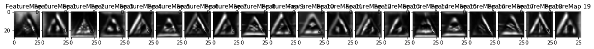

and then the "Right-of-way at the next intersection"

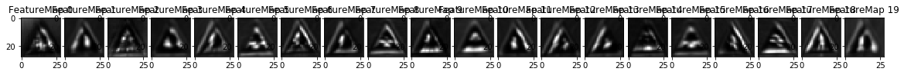

If we for example take a look at feature map 17 for all these,
we can kinda see that the 2 last rotation does look a bit more
to the Right-of-way at the next intersection, obviously this is
not enough, as it's just one of all the layers, so hard to really say 
something.


If we instead check for the same image but go deeper 

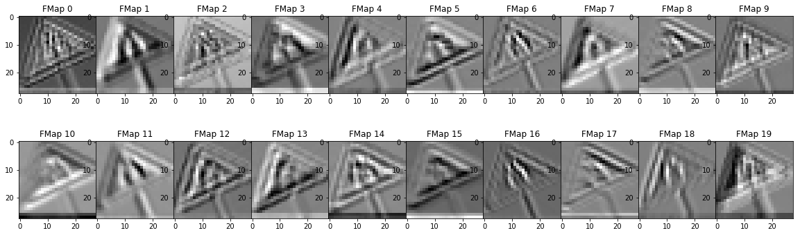

First we see what happens directly after first convolution

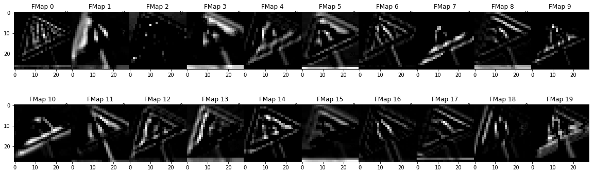

And then after using Relu. we can see that parts get "cut away", just as it should

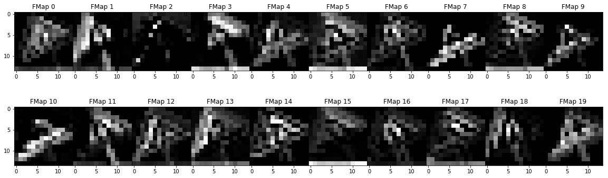

and then ofcourse the maxpooling, that makes the resulotion smaller by applying max over 2x2. Now let's skip a few layers, this is the 2nd last convolution layer.
We can clearly see that we get less pixels in each layer, but more layers. it's rather much zeros here.

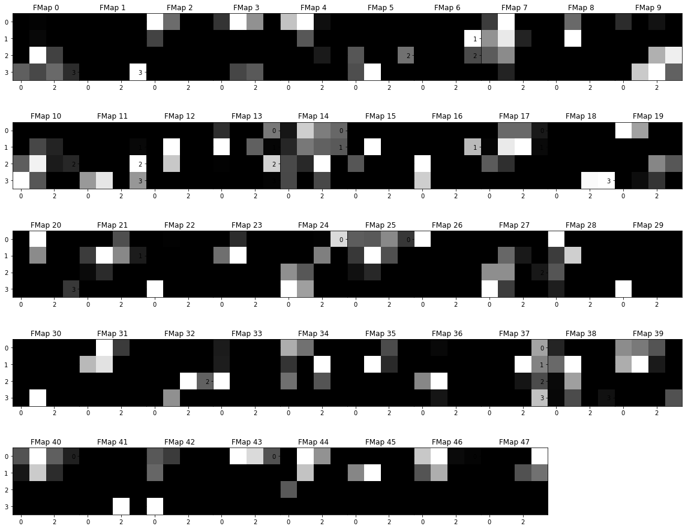

and after the 1x1 conv layer we can see that it have taken those and it's not as much zeros.. maybe good, I hope.

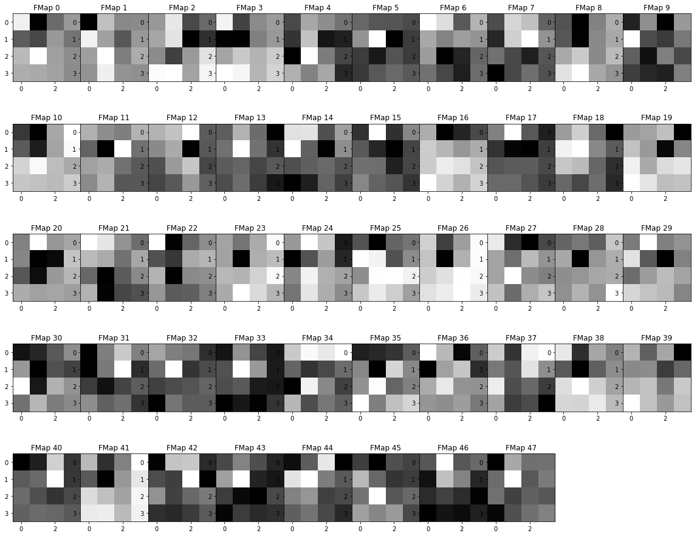


After doing all this I found in the forum someone talking about something called CLAHE. If I understand it correctly it norwalize the histogram over the images by taking just
part of it at a time.. 

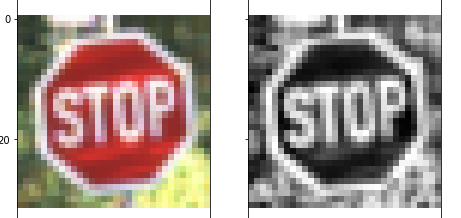 


This is obviosly much much better way of normalizing the image as much more deatails jumps out.. unfortunately I didn't have time to 
redo everything again. But Heres some statistics I got from just adding that:

Validation Accuracy = 0.988
Training Accuracy = 0.999
test Accuracy = 0.972

And the graph:

 

I also tried plotting how my extra images did during the training..

 

We can see that it actually did fail only one a few times in the beginning, so perhaps our network migth get a bit overfit, and the validation is just too similar to the training.. or just because
my own images just shouldn't be able to guess correct and it was just luck and actually did "worse" 

Another good thing is that we now took all the bumpy road and Beware of ice/snow that we failed before. 
But now we instead fail on "Vehicles over 3.5 metric tons prohibited" with just 0.58333337! :(


